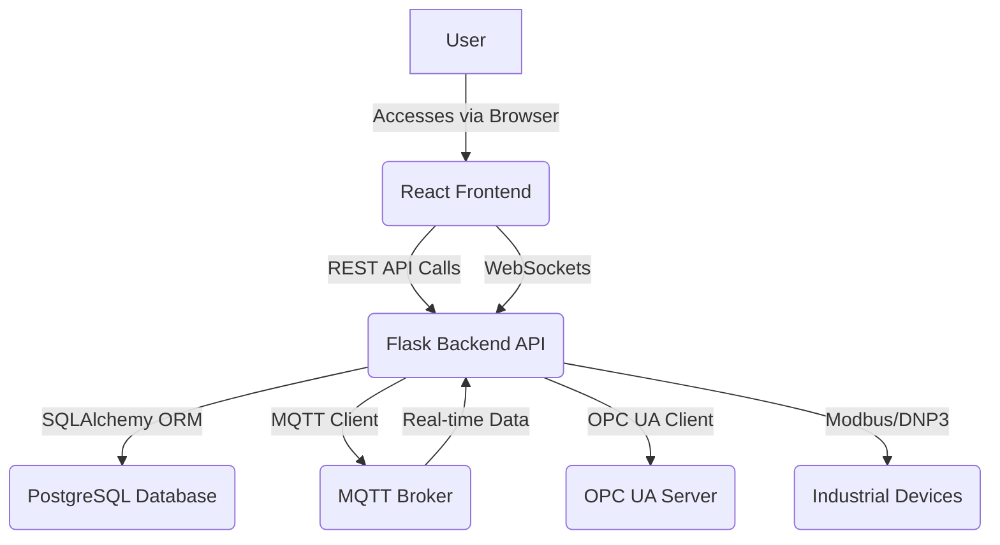

# Architecture Overview

> **Last Reviewed**: October 2024  
> **Status**: Current and Accurate

The ThermaCoreApp is a full-stack application designed for monitoring and managing industrial units, likely in a SCADA (Supervisory Control and Data Acquisition) context. It comprises a Python Flask backend API and a React frontend application, communicating primarily via RESTful APIs and WebSockets. The architecture emphasizes modularity, security, and scalability.

## 1. High-Level Architecture

The application follows a client-server architecture with a clear separation of concerns:

*   **Frontend (Client-side)**: A React application providing the user interface for interaction, data visualization, and control.
*   **Backend (Server-side)**: A Flask API serving data to the frontend, handling business logic, data storage, authentication, and communication with industrial protocols (MQTT, OPC UA, Modbus, DNP3).
*   **Database**: A PostgreSQL database for persistent storage of application data, user information, unit configurations, and sensor readings.
*   **Message Broker**: An MQTT broker for real-time data ingestion from industrial devices.

## 2. Backend Architecture (Flask API)

The backend is built with Flask and structured to be modular and extensible. Key components include:

*   **Application Factory (`app/__init__.py`)**: Responsible for creating and configuring the Flask application, initializing extensions (SQLAlchemy, JWT), registering blueprints, and setting up various services (MQTT, WebSocket, OPC UA, Anomaly Detection, Modbus, DNP3).
*   **Configuration (`config.py`)**: Manages application settings for different environments (development, production, testing), including database URIs, JWT secrets, MQTT, and OPC UA connection details. It enforces security best practices by recommending TLS for MQTT and specific security policies for OPC UA in production.
*   **Database Models (`app/models/__init__.py`)**: Defines the application's data structures using SQLAlchemy ORM. This includes `User`, `Role`, `Permission`, `Unit`, `Sensor`, and `SensorReading` models, establishing relationships and enumerations for various statuses and types.
*   **Routes (`app/routes/`)**: Organizes API endpoints into logical blueprints (e.g., `auth.py`, `analytics.py`, `units.py`, `scada.py`). Each route handles specific API requests, performs business logic, interacts with services, and returns JSON responses. It includes authentication (`jwt_required`) and permission checks (`permission_required`).
*   **Services (`app/services/`)**: Contains business logic and integrations with external systems or protocols. Examples include `mqtt_service`, `websocket_service`, `opcua_service`, `data_storage_service`, `anomaly_detection_service`, `modbus_service`, and `dnp3_service`.
*   **Middleware (`app/middleware/`)**: Implements cross-cutting concerns such as request ID generation, rate limiting, audit logging, and request validation (PR2 implementation).
*   **Utilities (`app/utils/`)**: Provides helper functions for environment management, error handling, and schema validation.
*   **Migrations (`migrations/`)**: Contains SQL scripts (`001_initial_schema.sql`, `002_seed_data.sql`) for database schema creation and initial data population, managed via Flask CLI commands (`flask init-db`).

## 3. Frontend Architecture (React Application)

The frontend is a React application built with Vite, utilizing modern JavaScript practices and a component-based architecture. Key aspects include:

*   **Component-Based Structure (`src/components/`)**: UI is broken down into reusable components (e.g., `Dashboard`, `SideNavigation`, `UnitDetails`, `FormField`). Specific subdirectories exist for common UI elements (`ui`), dashboard parts, reports, settings, and unit details.
*   **Pages (`src/pages/`)**: Defines the main views of the application, composed of various components (e.g., `Dashboard.jsx`, `AlarmsPage.jsx`, `UnitDetails.jsx`).
*   **State Management (`src/context/`)**: Uses React Context API for global state management, including `AuthContext`, `ThemeContext`, `SidebarContext`, and `UnitContext`, to share data across the component tree.
*   **Routing (`react-router-dom`)**: Manages client-side navigation between different views of the application, defined in `src/config/routes.js`.
*   **API Services (`src/services/`)**: Encapsulates API calls to the backend, providing a clean interface for components to fetch and send data (e.g., `authService.js`, `unitService.js`).
*   **Styling**: Utilizes Tailwind CSS (indicated by `@tailwindcss/vite` and `tailwind-merge` in `package.json`) for utility-first styling, potentially combined with custom CSS modules (`LoginScreen.module.css`). Radix UI components are used for accessible and customizable UI primitives.
*   **Utilities and Hooks (`src/utils/`, `src/hooks/`)**: Provides helper functions (e.g., `apiFetch.js`, `dateUtils.js`) and custom React hooks (e.g., `use-mobile.js`, `useRemoteControl.js`) to abstract common logic and side effects.
*   **Testing (`src/tests/`)**: Includes unit and integration tests for React components and services, using Vitest and React Testing Library.

## 4. Data Flow and Communication

*   **RESTful API**: The primary communication channel between the frontend and backend for data retrieval, updates, and command execution. JWTs are used for authentication and authorization.
*   **WebSockets**: Used for real-time data updates and notifications from the backend to the frontend, crucial for a SCADA system monitoring live sensor data and unit statuses.
*   **MQTT**: The backend subscribes to MQTT topics (`scada/+/temperature`, `scada/+/pressure`, etc.) to ingest real-time sensor data from industrial devices. This data is then processed and potentially stored in the database, and pushed to connected WebSocket clients.
*   **OPC UA, Modbus, DNP3**: The backend integrates with these industrial protocols via dedicated services to communicate with various types of industrial equipment, enabling data acquisition and remote control functionalities.

## 5. Security Considerations

*   **Authentication & Authorization**: JWT-based authentication is implemented, with roles and permissions (`RoleEnum`, `PermissionEnum`) controlling access to API endpoints. Audit logging tracks authentication events.
*   **Environment-Specific Configuration**: `config.py` differentiates settings for development and production, enforcing stricter security (e.g., TLS for MQTT, specific OPC UA security policies) in production environments.
*   **Input Validation**: Middleware for request validation (PR2 implementation) helps prevent common web vulnerabilities.
*   **Password Hashing**: `werkzeug.security` is used for secure password hashing.

This architecture provides a robust foundation for a SCADA application, enabling real-time monitoring, control, and data analysis of industrial units.
